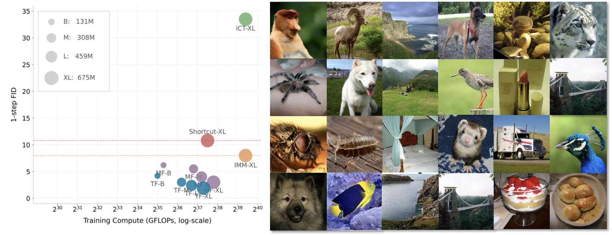

# Temporal Equilibrium MeanFlow

PyTorch implementation of **Temporal Equilibrium MeanFlow (TEMF)** for one-step image generation, built on top of the AlphaFlow codebase.

<p align="center">
  
</p>

## Overview

This repository adapts the AlphaFlow training and inference stack to support the main ideas from the paper:

- **Temporal equilibrium weighting** to balance optimization across different temporal intervals.
- **Dynamic boundary scheduling** to gradually shift training from boundary stabilization to trajectory learning.
- **One-step generation** in the AlphaFlow / MeanFlow-style latent diffusion pipeline.

The current codebase focuses on the **ImageNet 256x256 latent-space setting** used by the paper and keeps the original Hydra-based training workflow from AlphaFlow.

The latent extraction pipeline used in this repository follows the same implementation as the official MeanFlow codebase:

- https://github.com/zhuyu-cs/MeanFlow

The pre-extracted latent dataset `train_vae_latents_lmdb.lmdb` is also provided in the Hugging Face repository:

- https://huggingface.co/Tuyuanpeng/TEMF

## Features

- TEMF loss implemented in [`src/training/loss.py`](src/training/loss.py)
- Hydra experiment registry for AlphaFlow and TEMF presets
- Distributed training with `torchrun`
- One-step and few-step sampling
- FID evaluation, including an AlphaFlow-compatible PNG export path

## Repository Structure

```text
.
├── configs/                  # Hydra configs
│   ├── loss/                 # AlphaFlow / TEMF losses
│   ├── model/                # DiT and latent diffusion configs
│   ├── sampling/             # Sampling presets
│   ├── training/             # Training defaults
│   └── env/                  # User / local environment configs
├── infra/                    # Experiment launcher and registry
├── scripts/                  # Generation / evaluation utilities
├── src/                      # Core training, inference, metrics, data code
├── imgs/                     # README assets
└── Onestep.pdf               # Local copy of the paper
```

## Environment Setup

This repository provides a `requirements.txt` file for environment setup.

A typical setup is:

```bash
conda create -n temf python=3.10 -y
conda activate temf

# Install PyTorch that matches your CUDA version first.
# Example:
# pip install torch torchvision --index-url https://download.pytorch.org/whl/cu121

pip install -r requirements.txt
```

If your CUDA / PyTorch version needs to be installed separately, install the matching PyTorch build first and then run `pip install -r requirements.txt`.

## Configuration

Before training, create your user environment config:

```bash
cp configs/env/user-example.yaml configs/env/user.yaml
```

`configs/env/user.yaml` is a local-only file and is ignored by git in this repository.

Then edit `configs/env/user.yaml` and set at least:

- `project_path`
- `folder_datasets_path`
- `cache_dir`
- `dataset_stats_dir`
- `latents_stats_dir`
- `conda_env_dirname`
- `conda_init_bin_path`

For the training setup used in this repository, ImageNet experiments are run in **latent space** with pre-extracted latents. In the finetuning workflow, the dataset is typically provided as an LMDB of VAE latents, e.g.

```text
dataset.data_type=image_latent
dataset.src=/path/to/train_vae_latents_lmdb.lmdb
dataset.src_val=null
model.use_precomputed_latents=true
```

The raw ImageNet folders are still relevant for latent extraction and some evaluation setups:

```text
${env.folder_datasets_path}/imagenet/train/
${env.folder_datasets_path}/imagenet/val/
```

For the provided public training script [`run_temf_finetune.sh`](run_temf_finetune.sh), the default expected file layout is:

```text
${REPO_ROOT}/data/train_vae_latents_lmdb.lmdb
${REPO_ROOT}/data/adm_in256_stats.npz
${REPO_ROOT}/checkpoints/sd_vae_ft_ema.pt
```

If your files are stored elsewhere, override them with environment variables such as `LATENT_LMDB`, `FID_STATS`, `AE_CKPT`, and `MODEL_CKPT_OVERRIDE`.

## Training

The repository supports Hydra experiment configs and the launcher in [`infra/launch.py`](infra/launch.py), but the main workflow used here is **direct `torchrun` training / resume-finetuning**.

### Resume finetuning from a pretrained TEMF checkpoint

To continue training from a released TEMF checkpoint on latent-space ImageNet, use a command like:

- https://huggingface.co/Tuyuanpeng/TEMF

Before running the script, either place the required files in the default locations above, or explicitly override their paths.

The canonical public entrypoint is:

```bash
MODEL_CKPT_OVERRIDE=/path/to/temf_ckpt.pt \
LATENT_LMDB=/path/to/train_vae_latents_lmdb.lmdb \
FID_STATS=/path/to/adm_in256_stats.npz \
AE_CKPT=/path/to/sd_vae_ft_ema.pt \
bash run_temf_finetune.sh
```

For reference, the script currently expands to an XL-sized command of the following form:

```bash
torchrun --master_port=13221 --nproc_per_node=8 src/train.py \
  desc=temf-latentspace-XL-2-cfg-training-finetune \
  hydra.run.dir=/path/to/experiments/temf-latentspace-XL-2-cfg-training-finetune \
  hydra.output_subdir=null \
  hydra/job_logging=disabled \
  hydra/hydra_logging=disabled \
  model=dit_temf_ldm \
  loss=temf \
  dataset=imagenet \
  sampling=recflow \
  env=local \
  pre_extract_latents=none \
  quiet_launch=true \
  num_nodes=1 \
  wandb.tags='["temf-latentspace"]' \
  training.resume.on_start_ckpt_path=/path/to/temf_ckpt.pt \
  training.resume.whole_state=false \
  training.resume.allow_missing_extra_state_on_start=true \
  training.metrics='[fid50k_full]' \
  training.metrics_rare='[]' \
  training.metrics_final='[fid50k_full]' \
  training.fid_statistics_file=/path/to/adm_in256_stats.npz \
  '+training.metrics_extra_sampling_cfg_overwrites.NFE_2_recflow_sampling={num_steps:2}' \
  '+training.metrics_extra_sampling_cfg_overwrites.NFE_2_consistency_sampling={num_steps:2,enable_consistency_sampling:true}' \
  training.max_steps=1300000 \
  training.freqs.snapshot_latest=1000 \
  training.freqs.snapshot=10000 \
  training.freqs.loss_per_sigma=null \
  training.freqs.loss_val=null \
  training.freqs.metrics=100 \
  training.freqs.metrics_rare=50 \
  training.traj_len_for_vis_gen=1 \
  training.num_vis_samples=16 \
  training.dp.strategy=ddp \
  sampling.num_steps=1 \
  sampling.sigma_noise=1.0 \
  sampling.enable_trajectory_sampling=true \
  sampling.enable_consistency_sampling=false \
  dataset.name=imagenet_folder \
  dataset.resolution='[1,256,256]' \
  dataset.batch_gpu=32 \
  dataset.batch_size=256 \
  dataset.test_batch_gpu=1 \
  dataset.use_val_data_for_eval_stream=false \
  dataset.print_traceback=true \
  dataset.print_exceptions=true \
  dataset.data_type=image_latent \
  dataset.src=/path/to/train_vae_latents_lmdb.lmdb \
  dataset.src_val=null \
  model.use_precomputed_latents=true \
  model.num_blocks=28 \
  model.dim=1152 \
  model.num_heads=16 \
  model.label_dropout=0.1 \
  model.tokenizer.resolution='[1,2,2]' \
  model.optim.class_name=torch.optim.Adam \
  model.optim.betas='[0.9,0.95]' \
  model.optim.weight_decay=0.0 \
  model.optim.lr=5e-6 \
  model.dropout=0.0 \
  model.use_ema=true \
  model.ema_rampup_ratio=null \
  model.checkpointing=false \
  model.sigma_data=1.0 \
  model.use_fused_modulation=false \
  model.lr_scheduler.num_warmup_steps=0 \
  model.lr_scheduler.final_lr=5e-6 \
  model.autoencoder_ckpt.snapshot_path=/path/to/sd_vae_ft_ema.pt \
  model.autoencoder_ckpt.convert_params_to_buffers=false
```

The convenience script [`run_temf_finetune.sh`](run_temf_finetune.sh) uses the same assumptions and can be launched as:

```bash
bash run_temf_finetune.sh
```

or with explicit path overrides:

```bash
LATENT_LMDB=/path/to/train_vae_latents_lmdb.lmdb \
FID_STATS=/path/to/adm_in256_stats.npz \
AE_CKPT=/path/to/sd_vae_ft_ema.pt \
MODEL_CKPT_OVERRIDE=/path/to/temf_ckpt.pt \
bash run_temf_finetune.sh
```

The parameters above all exist in the current codebase. In particular:

- `loss=temf` maps to [`configs/loss/temf.yaml`](configs/loss/temf.yaml)
- `model=dit_temf_ldm` maps to [`configs/model/dit_temf_ldm.yaml`](configs/model/dit_temf_ldm.yaml)
- the underlying implementation is in [`src/training/loss.py`](src/training/loss.py)

### Launch a registered TEMF experiment

```bash
python3 infra/launch.py temf-latentspace-B-2
```

### Launch a stronger 1-NFE preset

```bash
python3 infra/launch.py temf-extreme-fid-B-2
```

### Run with custom overrides

```bash
python3 infra/launch.py temf-latentspace-B-2 \
  num_gpus=8 \
  training.max_steps=400000 \
  dataset.batch_size=256
```

### Run directly without spawning a separate experiment copy

Useful for debugging:

```bash
python3 infra/launch.py temf-latentspace-B-2 direct_launch=true debug_run=true
```

## Checkpoints

Pretrained checkpoints and the released latent LMDB are available on Hugging Face:

- https://huggingface.co/Tuyuanpeng/TEMF

This repository includes:

- TEMF checkpoints for resume / finetuning and inference
- `train_vae_latents_lmdb.lmdb` for latent-space ImageNet training

## Sampling

Generate images from a checkpoint with one-step TEMF sampling:

```bash
torchrun --standalone --nproc-per-node=8 scripts/generate.py \
  ckpt.snapshot_path=/path/to/checkpoint.pt \
  output_dir=/path/to/output_samples \
  seeds=0-49999 \
  batch_size=32 \
  sampling=temf_onestep_fid
```

You can also override sampling parameters inline:

```bash
torchrun --standalone --nproc-per-node=8 scripts/generate.py \
  ckpt.snapshot_path=/path/to/checkpoint.pt \
  output_dir=/path/to/output_samples \
  seeds=0-1023 \
  batch_size=32 \
  sampling=temf_onestep_fid \
  sampling.num_steps=1 \
  sampling.enable_trajectory_sampling=true
```

## Evaluation

### Evaluate an existing folder of generated PNGs

```bash
torchrun --standalone --nproc-per-node=8 scripts/evaluate.py \
  eval_backend=temf \
  skip_generation=true \
  output_dir=/path/to/generated_pngs \
  fid_statistics_file=/path/to/adm_in256_stats.npz
```

### Generate and evaluate from a checkpoint in one command

```bash
torchrun --standalone --nproc-per-node=8 scripts/evaluate.py \
  eval_backend=temf \
  skip_generation=false \
  ckpt.snapshot_path=/path/to/checkpoint.pt \
  output_dir=/path/to/eval_outputs \
  fid_statistics_file=/path/to/adm_in256_stats.npz \
  sampling=temf_onestep_fid
```


## Citation

If you use this repository, please cite the TEMF paper and the AlphaFlow codebase it builds on.

```bibtex
@misc{tu2026temf,
  title={Temporal Equilibrium MeanFlow: Bridging the Scale Gap for One-Step Generation},
  author={Yuanpeng Tu and Yunpeng Chen and Xinyu Zhang and Chao Liao and Hengshuang Zhao},
  year={2026}
}
```

## Acknowledgements

- AlphaFlow / MeanFlow for the base training and inference framework
- DiT-style latent diffusion tooling used throughout the repository
